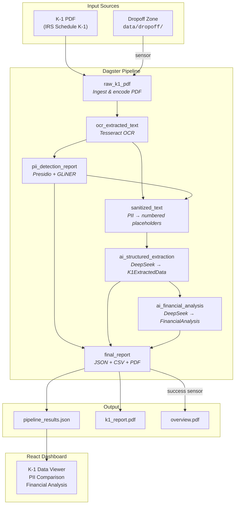
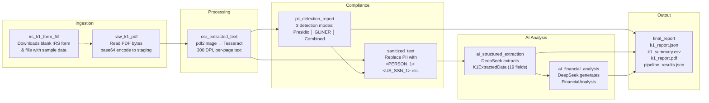
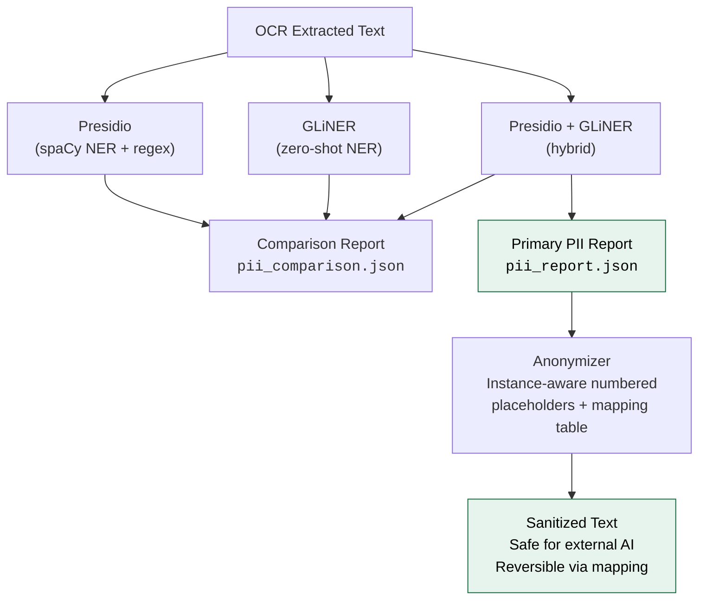
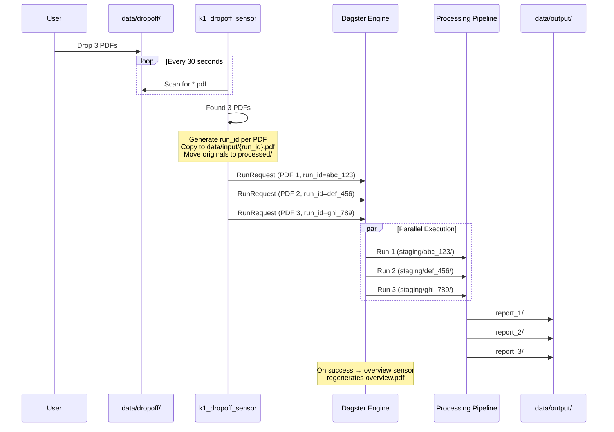
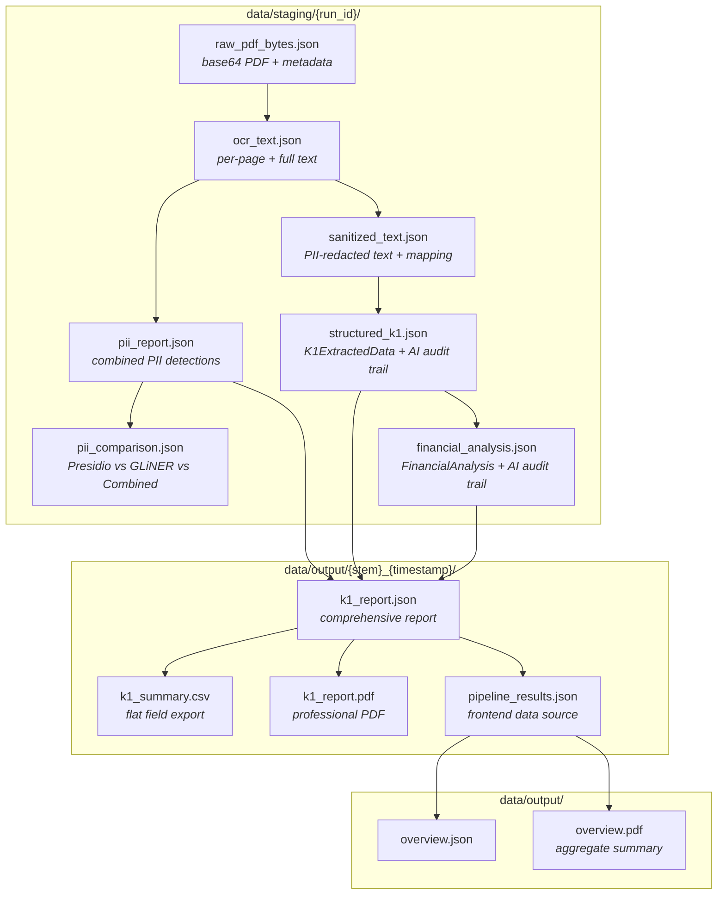
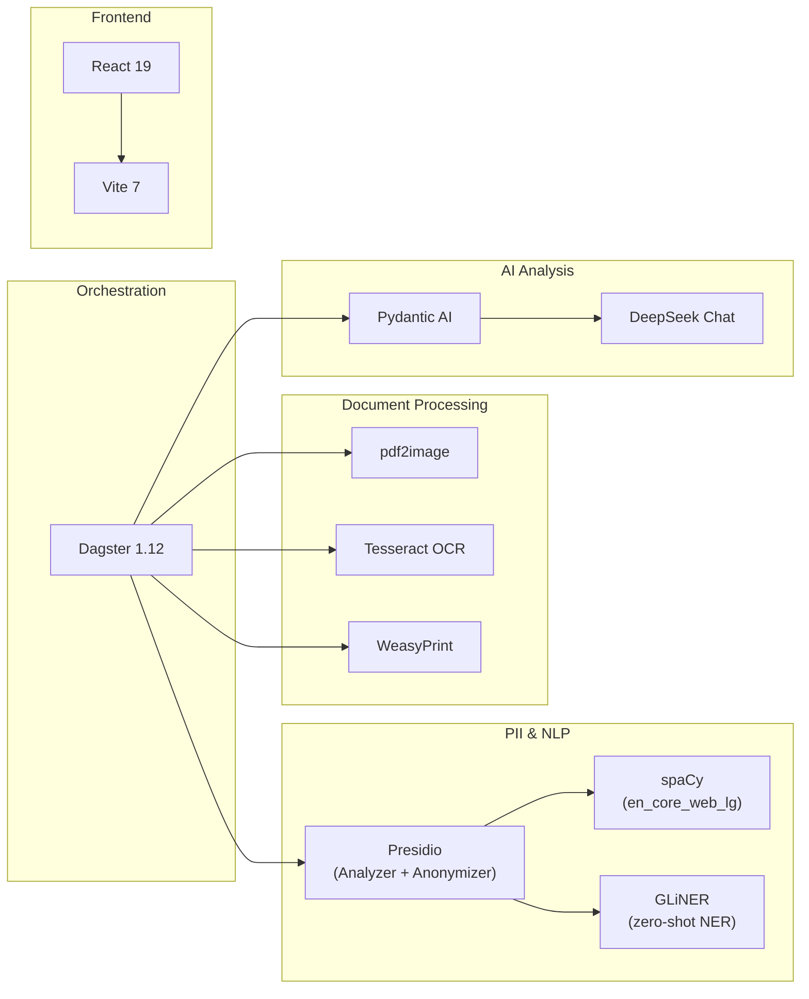

# K-1 Document Intelligence Pipeline

**GitHub:** [github.com/danielpodrazka/dagster-document-intelligence](https://github.com/danielpodrazka/dagster-document-intelligence)

A data pipeline built with **Dagster** that automatically ingests IRS Schedule K-1 tax documents, detects and redacts PII, extracts structured financial data using AI, and generates professional PDF reports — with a React dashboard for visualization.

Built as an educational project demonstrating how to combine document processing, compliance automation, and AI-powered analysis in a modern data orchestration framework.

## Architecture Overview



## Pipeline Deep Dive

Each asset transforms data through a specific stage. All intermediate results are persisted to staging as JSON for full auditability.



## PII Detection Strategy

The pipeline runs three PII detection approaches and produces a side-by-side comparison:



| Entity Type | Presidio | GLiNER | Combined |
|---|---|---|---|
| PERSON | regex + spaCy | zero-shot NER | both |
| US_SSN | regex pattern | zero-shot NER | both |
| EIN | custom regex `\d{2}-\d{7}` | tax ID mapping | both |
| ADDRESS | spaCy LOCATION | zero-shot NER | both |
| PHONE_NUMBER | regex | zero-shot NER | both |
| EMAIL_ADDRESS | regex | zero-shot NER | both |

## Dropoff Sensor & Parallel Processing

The file-watching sensor enables automated processing. Drop PDFs into `data/dropoff/` and the pipeline handles everything:



**Parallel isolation** is achieved via `K1RunConfig`:
- Each run gets a unique `run_id` (e.g., `profile_01_1708444800`)
- Staging directory: `data/staging/{run_id}/`
- Input PDF: `data/input/{run_id}.pdf`
- Output: `data/output/{pdf_stem}_{YYYYMMDD_HHMMSS}/`

**Failure handling**: if a run fails, the `k1_dropoff_failure_sensor` moves the PDF from `processed/` to `failed/` for manual review.

## Project Structure

```
dagster-document-intelligence/
├── pipeline/                             # Dagster project
│   ├── pyproject.toml                    # Python deps (dagster, presidio, pydantic-ai, etc.)
│   ├── src/k1_pipeline/
│   │   ├── definitions.py                # Entry point: @definitions + load_from_defs_folder
│   │   └── defs/
│   │       ├── assets.py                 # 7 pipeline assets + K1RunConfig
│   │       ├── sensors.py                # Dropoff sensor + failure sensor
│   │       ├── overview.py               # Aggregated overview asset + success sensor
│   │       └── pdf_templates.py          # WeasyPrint HTML→PDF templates
│   ├── scripts/
│   │   ├── generate_batch_k1s.py         # Generate all 10 test K-1 PDFs from IRS form
│   │   ├── fill_irs_k1.py               # Fill official IRS form (single profile)
│   │   ├── generate_sample_k1.py         # Synthetic K-1 via ReportLab (unused)
│   │   ├── k1_profiles_1_5.py            # Test profiles 1-5 (RE, VC, hedge, PE, energy)
│   │   └── k1_profiles_6_10.py           # Test profiles 6-10 (LLC, medical, CRE, clean energy, restaurant)
│   └── data/
│       ├── input/                        # Source PDFs
│       │   ├── archive/                  # Blank IRS forms, samples
│       │   └── batch/                    # 10 test profile PDFs
│       ├── staging/                      # Intermediate JSON (per-run isolated)
│       ├── output/                       # Final reports (timestamped dirs)
│       └── dropoff/                      # Auto-processing zone
│           ├── processed/                # Successfully picked up
│           └── failed/                   # Moved here on pipeline failure
├── frontend/                             # React + Vite dashboard
│   ├── package.json                      # React 19, Vite 7
│   ├── src/
│   │   ├── App.jsx                       # Dashboard components
│   │   └── App.css                       # Navy/white professional theme
│   └── public/
│       └── pipeline_results.json         # Copied from pipeline output
└── .env                                  # DEEPSEEK_API_KEY
```

## Data Flow & File Artifacts



## Extracted K-1 Fields

The AI extraction step maps OCR text to a strongly-typed Pydantic model with 19 financial fields:

| Field | IRS Box | Description |
|---|---|---|
| `tax_year` | — | Tax year for the K-1 |
| `partnership_name` | Part I | Name of partnership or S-Corp |
| `partner_type` | Part II | General or Limited partner |
| `partner_share_percentage` | J | Profit/loss/capital share % |
| `ordinary_business_income` | Box 1 | Ordinary business income (loss) |
| `rental_real_estate_income` | Box 2 | Net rental real estate income (loss) |
| `guaranteed_payments` | Box 4 | Guaranteed payments to partner |
| `interest_income` | Box 5 | Interest income |
| `ordinary_dividends` | Box 6a | Ordinary dividends |
| `qualified_dividends` | Box 6b | Qualified dividends |
| `short_term_capital_gains` | Box 8 | Net short-term capital gain (loss) |
| `long_term_capital_gains` | Box 9a | Net long-term capital gain (loss) |
| `section_179_deduction` | Box 12 | Section 179 deduction |
| `self_employment_earnings` | Box 14 | Self-employment earnings (loss) |
| `foreign_taxes_paid` | Box 16 | Foreign taxes paid or accrued |
| `distributions` | Box 19 | Distributions received |
| `qbi_deduction` | Box 20z | Qualified business income deduction |
| `capital_account_beginning` | L | Beginning capital account |
| `capital_account_ending` | L | Ending capital account |

## Tech Stack



| Layer | Technology | Purpose |
|---|---|---|
| Orchestration | Dagster | Asset-based pipeline, sensors, jobs |
| PDF → Images | pdf2image + Poppler | Rasterize PDF pages at 300 DPI |
| OCR | Tesseract | Extract text from page images |
| PII Detection | Presidio + spaCy + GLiNER | Hybrid NER for comprehensive PII coverage |
| PII Anonymization | Custom instance-aware anonymizer | Replace entities with numbered placeholders (`<PERSON_1>`) + reversible mapping |
| AI Extraction | Pydantic AI + DeepSeek | Structured data extraction from text |
| AI Analysis | Pydantic AI + DeepSeek | Financial analysis and recommendations |
| PDF Reports | WeasyPrint | HTML templates → professional PDFs |
| Test Data | PyPDFForm + ReportLab | Fill official IRS K-1 blanks with sample data |
| Frontend | React + Vite | Interactive dashboard for results |

## Getting Started

### Prerequisites

- Python 3.10+
- [uv](https://docs.astral.sh/uv/) (Python package manager)
- [Tesseract OCR](https://github.com/tesseract-ocr/tesseract) (`apt install tesseract-ocr`)
- [Poppler](https://poppler.freedesktop.org/) (`apt install poppler-utils`)
- Node.js 18+ (for the frontend)

### Setup

```bash
# Clone the repo
git clone https://github.com/danielpodrazka/dagster-document-intelligence.git && cd dagster-document-intelligence

# Create .env with your DeepSeek API key
echo "DEEPSEEK_API_KEY=your-key-here" > .env

# Install Python dependencies
cd pipeline
uv sync

# Start Dagster
dg dev    # opens at http://localhost:3000
```

### Running the Pipeline

**Option 1 — Manual (Dagster UI):**
1. Open http://localhost:3000
2. Navigate to Assets
3. Click "Materialize all" to run the full pipeline

**Option 2 — Dropoff sensor (automatic):**
1. In the Dagster UI, go to Sensors and enable `k1_dropoff_sensor`
2. Drop PDF files into `pipeline/data/dropoff/`
3. The sensor picks them up within 30 seconds and processes them in parallel

### Frontend Dashboard

```bash
cd frontend
npm install
npm run dev    # opens at http://localhost:5173
```

Copy results from the pipeline output to the frontend:
```bash
cp pipeline/data/output/*/pipeline_results.json frontend/public/
```

## Sample Test Profiles

The repo includes 10 realistic K-1 partner profiles for testing, each with distinct financial characteristics:

| # | Partnership | Type | Characteristics |
|---|---|---|---|
| 1 | Sunbelt Retail Real Estate Fund II | LP | Real estate, loss position |
| 2 | Sequoia Ridge Venture Partners III | LP | Venture capital |
| 3 | Blackwater Offshore Macro Fund | LP | Hedge fund |
| 4 | Ironclad Industrial Buyout Fund IV | LP | Private equity |
| 5 | Permian Basin Royalties & Exploration | LP | Energy/oil, profitable |
| 6 | Nakamura Family Investment LLC | Trust | Net loss |
| 7 | Pacific Coast Orthopedic Partners LLP | GP | Medical practice |
| 8 | Sunbelt CRE Opportunity Fund III | LP | Commercial RE, Section 179 |
| 9 | Cascadia Clean Energy Fund | LP | Renewables, foreign taxes |
| 10 | Southern Hospitality Restaurant Group | GP | Restaurant, S-Corp |

### Generating test data

All test PDFs are generated by filling the **official IRS Schedule K-1 (Form 1065) 2024** with fictitious data using PyPDFForm. The blank form is downloaded from irs.gov automatically on first run.

```bash
cd pipeline

# Generate all 10 test profile K-1 PDFs (recommended)
uv run python scripts/generate_batch_k1s.py
# → data/input/batch/profile_01_sunbelt_retail_real_estate_fund_ii_lp.pdf
# → data/input/batch/profile_02_sequoia_ridge_venture_partners_iii_lp.pdf
# → ... (10 PDFs + manifest.json)

# Generate a single filled IRS K-1 (one hardcoded profile)
uv run python scripts/fill_irs_k1.py
# → data/input/irs_k1_filled.pdf
```

You can also materialize the `irs_k1_form_fill` asset in the Dagster UI to generate the single filled form.

Profile data for the 10 test partners is defined in:

- `scripts/k1_profiles_1_5.py` — real estate, venture capital, hedge fund, private equity, energy
- `scripts/k1_profiles_6_10.py` — family LLC, medical practice, commercial RE, clean energy, restaurant

> **Note:** `scripts/generate_sample_k1.py` generates a synthetic K-1 using ReportLab (not the official IRS form). It's kept for reference but the pipeline uses the official IRS form for realistic testing.

## Dagster Definitions

All definitions are auto-discovered via `load_from_defs_folder`:

```python
# definitions.py
@definitions
def defs():
    return load_from_defs_folder(path_within_project=Path(__file__).parent)
```

| Definition | File | Description |
|---|---|---|
| `irs_k1_form_fill` | assets.py | Download + fill IRS K-1 blank |
| `raw_k1_pdf` | assets.py | Ingest PDF into staging |
| `ocr_extracted_text` | assets.py | OCR via Tesseract |
| `pii_detection_report` | assets.py | Presidio + GLiNER PII scan |
| `sanitized_text` | assets.py | Anonymize PII |
| `ai_structured_extraction` | assets.py | DeepSeek → K1ExtractedData |
| `ai_financial_analysis` | assets.py | DeepSeek → FinancialAnalysis |
| `final_report` | assets.py | Generate all output files |
| `processing_overview` | overview.py | Aggregate overview JSON + PDF |
| `k1_dropoff_processing_job` | sensors.py | Job for single-doc processing |
| `k1_dropoff_sensor` | sensors.py | File watcher for dropoff/ |
| `k1_dropoff_failure_sensor` | sensors.py | Move PDF to failed/ on error |
| `overview_job` | overview.py | Job to regenerate overview |
| `k1_overview_on_success` | overview.py | Trigger overview after success |

## Built with Claude Code + Dagster Skills

This project was built using [Claude Code](https://claude.com/claude-code) with skills from the official [dagster-io/skills](https://github.com/dagster-io/skills) repository — a collection of Claude Code skills maintained by the Dagster team for building production-quality data pipelines.

The skills live in `.claude/skills/` and give Claude deep knowledge of Dagster patterns, best practices, and CLI workflows:

| Skill | Source | What it does |
|---|---|---|
| **dagster-expert** | [dagster-io/skills](https://github.com/dagster-io/skills) | Expert guidance for assets, sensors, jobs, schedules, `dg` CLI, project structure, and declarative automation. Routes to detailed reference docs for every Dagster concept. |
| **dagster-integrations** | [dagster-io/skills](https://github.com/dagster-io/skills) | Discovers and configures integration libraries (dbt, Fivetran, Airbyte, etc.). Includes YAML schema, adapter requirements, and scaffolding patterns. |
| **dignified-python** | [dagster-io/skills](https://github.com/dagster-io/skills) | Production Python coding standards (3.10–3.13). Enforces modern type syntax, LBYL exception handling, pathlib operations, and clean API design. |
| **pr-workflow** | [dagster-io/skills](https://github.com/dagster-io/skills) | Automated PR creation with GitHub Copilot review handling, comment threading, and thread resolution via GraphQL. |

### How the skills helped

- **dagster-expert** — guided the sensor implementation (file-watching pattern, `RunRequest` with `run_config`, `run_failure_sensor`), parallel processing via `dg.Config`, and `load_from_defs_folder` project structure
- **dagster-integrations** — provided context on available Dagster integration options for AI/ML, storage, and compute
- **dignified-python** — enforced modern Python patterns: `pathlib` over `os.path`, proper type annotations, clean module structure

### Installing the skills

```bash
# From the dagster-io/skills repo
claude skills install dagster-io/skills
```

Or copy the `.claude/skills/` directory into your own project.

## Making It Production-Ready

This project is an educational demo with local file storage and no deployment infrastructure. Here are concrete steps to take it toward production use:

**Storage & Infrastructure**
- **AWS S3 integration** — swap local file I/O for S3 using Dagster's [`S3Resource`](https://docs.dagster.io/integrations/libraries/aws/s3/s3-resource) or a custom I/O manager. The pipeline already isolates runs by directory, so the migration is straightforward
- **Containerization** — add `Dockerfile` and `docker-compose.yml` to bundle Tesseract, Poppler, WeasyPrint, and the Python environment into a reproducible image
- **Deploy to Dagster+** — use [Dagster+](https://dagster.io/plus) for managed orchestration, or self-host with the Dagster Helm chart on Kubernetes

**Validation & Compliance**
- **Domain-driven validation** — add checks that verify extracted K-1 data against IRS rules (e.g., Box 1 + Box 2 + Box 3 = total income, partner share percentages sum to 100% across all partners, required fields are non-null)
- **Dagster asset checks** — use [`@asset_check`](https://docs.dagster.io/concepts/assets/asset-checks) to enforce data quality gates between pipeline stages (e.g., OCR confidence thresholds, PII detection completeness, extraction field coverage)
- **Input validation** — verify uploaded PDFs are actually K-1 forms before processing (page count, form number detection, IRS header matching)

**Reports & Output**
- **Branded PDF reports** — replace the generic HTML templates in `pdf_templates.py` with firm-branded designs (logo, color scheme, footer disclaimers, custom typography)
- **Database storage** — persist extracted K-1 data to [DuckDB](https://duckdb.org/) on top of S3 for analytical queries across clients and tax years, with [DuckLake](https://ducklake.select/) as a catalog layer for discoverability and metadata management

**Operations**
- **Testing** — add unit tests for PII detection accuracy, extraction field mapping, and PDF generation; integration tests for end-to-end pipeline runs
- **CI/CD** — GitHub Actions pipeline for linting, testing, and building the Docker image on push
- **Monitoring & alerting** — configure Dagster sensors or external tools (PagerDuty, Slack) to alert on pipeline failures, and track extraction accuracy metrics over time
- **Authentication** — add auth to the React dashboard (currently open) and restrict access to sensitive PII data

## License

MIT License. See [LICENSE](LICENSE) for details. Not intended for production tax processing.
