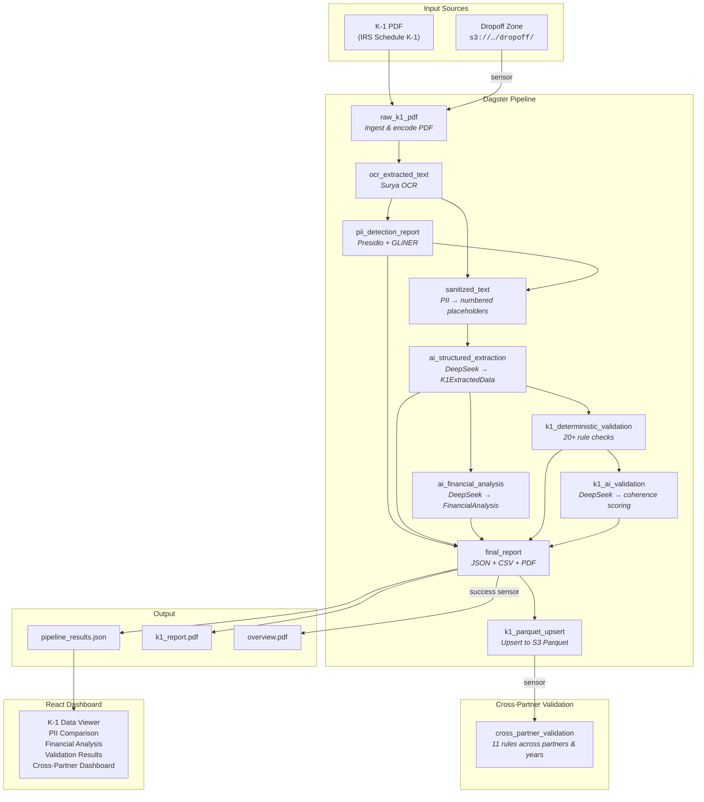
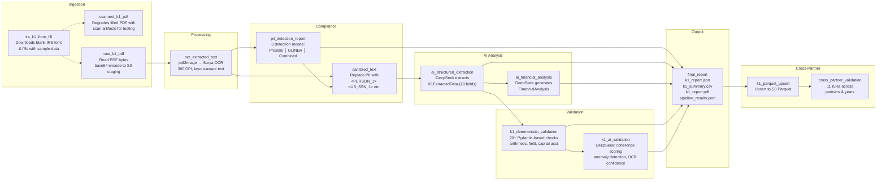
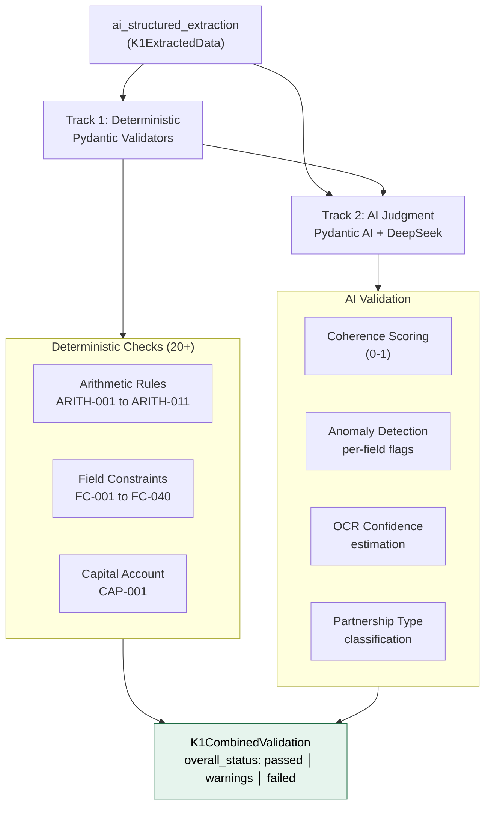
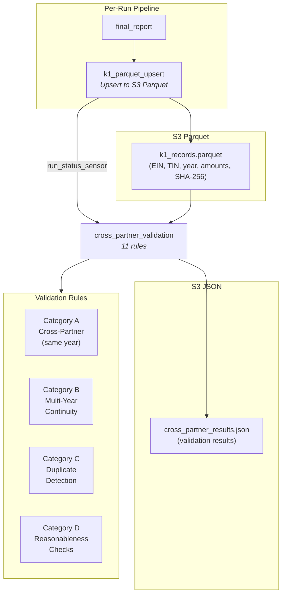
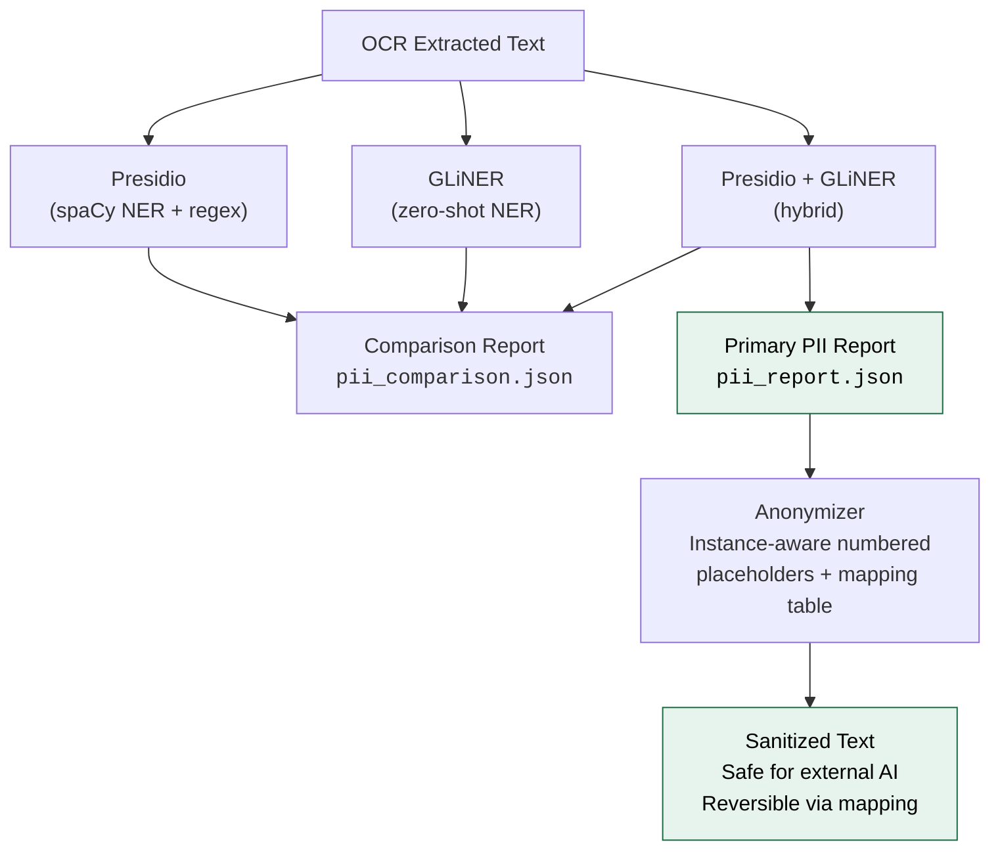
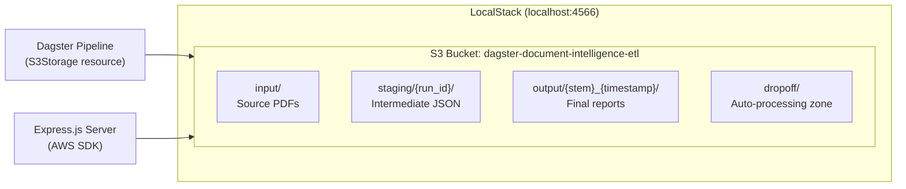
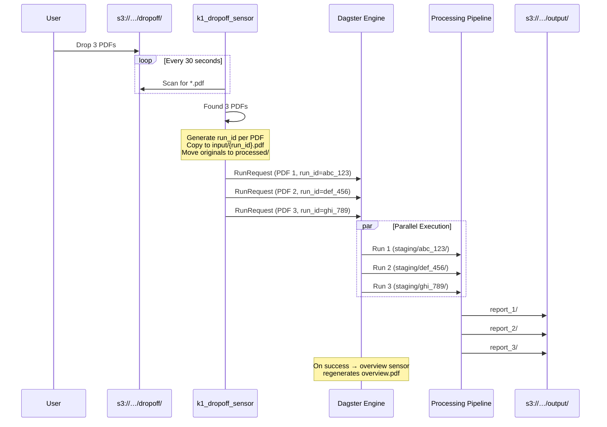
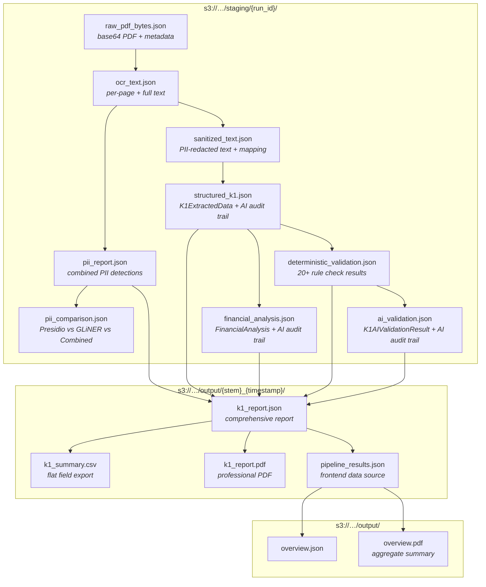
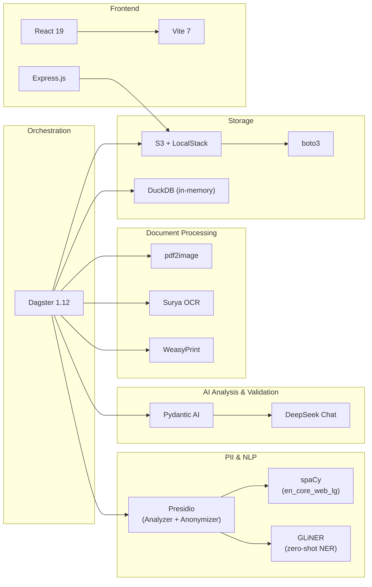

# K-1 Document Intelligence Pipeline

A data pipeline built with **Dagster** that automatically ingests IRS Schedule K-1 tax documents, detects and redacts PII, extracts structured financial data using AI, validates results with a two-track system (deterministic + AI), and generates professional PDF reports — with a React dashboard for visualization. All storage is S3-backed via LocalStack for local development.

Built as an educational project demonstrating how to combine document processing, compliance automation, and AI-powered analysis in a modern data orchestration framework.

This is a demo project. If you are processing large amounts of K-1s and need a production-grade document intelligence pipeline, contact me at build@daniep.com

## Presentation

[](https://www.youtube.com/watch?v=XCDDwKWYjhY)

## Architecture Overview



## Pipeline Deep Dive

Each asset transforms data through a specific stage. All intermediate results are persisted to S3 staging as JSON for full auditability.



## Two-Track Validation System

The pipeline validates extracted K-1 data using a dual-track architecture — deterministic rule checks run first, followed by AI judgment:



**Deterministic checks** (Track 1) run 20+ Pydantic-validated rules with severity levels:

| Category | Rule IDs | Examples |
|---|---|---|
| Arithmetic | ARITH-001 to ARITH-011 | Qualified dividends ≤ ordinary dividends, partner share % in (0, 100], SE earnings vs partner type |
| Field Constraints | FC-001 to FC-040 | Required fields present, non-negative enforcement, Section 179 statutory limit, magnitude sanity |
| Capital Account | CAP-001 | Capital account reconciliation (beginning + income - distributions ≈ ending) |

**AI validation** (Track 2) uses DeepSeek to assess overall data quality:
- `overall_coherence_score` — internal consistency across all fields
- `ocr_confidence_score` — estimated OCR extraction accuracy
- `partnership_type_assessment` — inferred type (investment, RE, operating, etc.)
- `anomaly_flags` — per-field anomalies with confidence scores
- `value_reasonableness` — per-field 0-1 scores for every non-null field
- `recommended_review_fields` — fields warranting manual inspection

## Cross-Partner Validation

After each K-1 is processed, the `k1_parquet_upsert` asset upserts the extracted data into a Parquet file on S3 (`output/k1_records.parquet`). A sensor then triggers `cross_partner_validation`, which loads the Parquet into in-memory DuckDB and runs 11 rules across all accumulated records — catching inconsistencies that are invisible when looking at a single K-1 in isolation.



| Rule ID | Category | Severity | Description |
|---|---|---|---|
| `CROSS_A1_PROFIT_PCT_SUM` | A | critical | Partner profit percentages must not exceed 100% |
| `CROSS_A2_PCT_SUM_INCOMPLETE` | A | advisory | Warn if percentages sum to less than 100% (missing partners) |
| `CROSS_A3_INCOME_PROPORTIONALITY` | A | warning | Income allocations should be proportional to profit share |
| `CROSS_A4_CAPITAL_ACCOUNT_CONSISTENCY` | A | warning | Capital accounts should be proportional to capital percentage |
| `CROSS_A5_PARTNERSHIP_IDENTITY` | A | warning | Partnership names must be consistent across K-1s for same EIN |
| `CROSS_B1_CAPITAL_CONTINUITY` | B | critical | Ending capital (year N) must equal beginning capital (year N+1) |
| `CROSS_B3_PARTNERSHIP_IDENTITY_MULTIYEAR` | B | warning | Partnership name consistent across tax years |
| `CROSS_B4_PARTNER_TYPE_CONTINUITY` | B | warning | Partner type (GP/LP) should not change between years |
| `CROSS_C1_EXACT_DUPLICATE` | C | critical | Detect exact duplicate K-1 records (same key + identical amounts) |
| `CROSS_C2_AMENDED_K1` | C | warning | Detect possible amended K-1s (same key, different amounts) |
| `CROSS_D1_DISTRIBUTION_REASONABLENESS` | D | warning | Total distributions should not vastly exceed total income |
| `CROSS_D4_SE_CONSISTENCY` | D | warning | Self-employment earnings must be consistent with partner type |

The `k1_parquet_upsert` asset uses a file lock to serialize its read-modify-write of the Parquet file across Dagster's multi-process run launcher. Reads in `cross_partner_validation` don't need locking since Parquet files in S3 are immutable snapshots. The OCR step also uses a separate file lock to serialize GPU access across parallel runs.

## PII Detection Strategy

The pipeline runs three PII detection approaches and produces a side-by-side comparison:



| Entity Type | Presidio | GLiNER | Combined |
|---|---|---|---|
| PERSON | regex + spaCy | zero-shot NER | both |
| US_SSN | regex pattern | zero-shot NER | both |
| EIN | custom regex `\d{2}-\d{7}` | tax ID mapping | both |
| ADDRESS | spaCy LOCATION | zero-shot NER | both |
| PHONE_NUMBER | regex | zero-shot NER | both |
| EMAIL_ADDRESS | regex | zero-shot NER | both |

## S3 Storage Architecture

All pipeline I/O is routed through an `S3Storage` ConfigurableResource backed by LocalStack for local development:



The `S3Storage` Dagster resource provides key builders (`staging_key`, `output_key`, `input_key`) and read/write helpers for JSON, bytes, and text — making the migration path to real AWS S3 a configuration change.

## Dropoff Sensor & Parallel Processing

The file-watching sensor enables automated processing. Drop PDFs into `s3://…/dropoff/` and the pipeline handles everything:



**Parallel isolation** is achieved via `K1RunConfig`:
- Each run gets a unique `run_id` (e.g., `profile_01_1708444800`)
- Staging prefix: `staging/{run_id}/`
- Input PDF: `input/{run_id}.pdf`
- Output: `output/{pdf_stem}_{YYYYMMDD_HHMMSS}/`

**Failure handling**: if a run fails, the `k1_dropoff_failure_sensor` moves the PDF from `processed/` to `failed/` for manual review.

## Project Structure

```
dagster-document-intelligence/
├── pipeline/                             # Dagster project
│   ├── pyproject.toml                    # Python deps (dagster, presidio, surya-ocr, pydantic-ai, boto3, etc.)
│   ├── src/k1_pipeline/
│   │   ├── definitions.py                # Entry point: @definitions + load_from_defs_folder
│   │   └── defs/
│   │       ├── assets.py                 # 8 pipeline assets + K1RunConfig + Pydantic models
│   │       ├── validation.py             # 2-track validation (deterministic + AI) + 2 assets
│   │       ├── cross_partner.py          # Cross-partner validation assets + sensor + job (S3 Parquet + in-memory DuckDB)
│   │       ├── cross_partner_rules.py    # 11 cross-partner validation rule functions
│   │       ├── sensors.py                # Dropoff sensor + failure sensor
│   │       ├── overview.py               # Aggregated overview asset + success sensor
│   │       ├── resources.py              # S3Storage ConfigurableResource (boto3/LocalStack)
│   │       └── pdf_templates.py          # WeasyPrint HTML→PDF templates
│   ├── scripts/
│   │   ├── generate_batch_k1s.py         # Generate all 10 test K-1 PDFs from IRS form
│   │   ├── generate_cross_partner_k1s.py # Generate 8 cross-partner test K-1 PDFs (profiles 11-18)
│   │   ├── run_all_pdfs.py              # Batch runner: process all PDFs + cross-partner validation
│   │   ├── fill_irs_k1.py               # Fill official IRS form (single profile)
│   │   ├── minify_instructions.py        # Markdown instruction minifier for AI context
│   │   ├── generate_sample_k1.py         # Synthetic K-1 via ReportLab (unused)
│   │   ├── k1_profiles_1_5.py            # Test profiles 1-5 (RE, VC, hedge, PE, energy)
│   │   ├── k1_profiles_6_10.py           # Test profiles 6-10 (LLC, medical, CRE, clean energy, restaurant)
│   │   └── k1_cross_partner_profiles.py  # Test profiles 11-18 (cross-partner & multi-year)
│   └── data/                             # Mirrored from S3 bucket (LocalStack)
│       ├── input/                        # Source PDFs
│       │   ├── archive/                  # Blank IRS forms, samples
│       │   └── batch/                    # 10 test profile PDFs
│       ├── staging/                      # Intermediate JSON (per-run isolated)
│       ├── output/                       # Final reports (timestamped dirs)
│       └── dropoff/                      # Auto-processing zone
│           ├── processed/                # Successfully picked up
│           └── failed/                   # Moved here on pipeline failure
├── frontend/                             # React + Vite dashboard
│   ├── package.json                      # React 19, Vite 7, AWS SDK
│   ├── server.js                         # Express.js API server (reads S3 via AWS SDK)
│   ├── src/
│   │   ├── App.jsx                       # Dashboard components
│   │   └── App.css                       # Navy/white professional theme
│   └── public/
├── docs/
│   └── validation/                       # Comprehensive validation rules documentation
│       ├── 01_arithmetic_rules.md        # 14 arithmetic rules with IRS references
│       ├── 02_field_constraints.md       # Field-level constraints
│       ├── 03_capital_account_rules.md   # Capital account validation
│       ├── 04_cross_partner_validation.md  # Multi-partner checks (future)
│       └── 05_validation_design.md       # Complete design spec (1400+ lines)
└── .env                                  # DEEPSEEK_API_KEY
```

## Data Flow & File Artifacts



## Extracted K-1 Fields

The AI extraction step maps OCR text to a strongly-typed Pydantic model with 19 financial fields:

| Field | IRS Box | Description |
|---|---|---|
| `tax_year` | — | Tax year for the K-1 |
| `partnership_name` | Part I | Name of partnership or S-Corp |
| `partner_type` | Part II | General or Limited partner |
| `partner_share_percentage` | J | Profit/loss/capital share % |
| `ordinary_business_income` | Box 1 | Ordinary business income (loss) |
| `rental_real_estate_income` | Box 2 | Net rental real estate income (loss) |
| `guaranteed_payments` | Box 4 | Guaranteed payments to partner |
| `interest_income` | Box 5 | Interest income |
| `ordinary_dividends` | Box 6a | Ordinary dividends |
| `qualified_dividends` | Box 6b | Qualified dividends |
| `short_term_capital_gains` | Box 8 | Net short-term capital gain (loss) |
| `long_term_capital_gains` | Box 9a | Net long-term capital gain (loss) |
| `section_179_deduction` | Box 12 | Section 179 deduction |
| `self_employment_earnings` | Box 14 | Self-employment earnings (loss) |
| `foreign_taxes_paid` | Box 16 | Foreign taxes paid or accrued |
| `distributions` | Box 19 | Distributions received |
| `qbi_deduction` | Box 20z | Qualified business income deduction |
| `capital_account_beginning` | L | Beginning capital account |
| `capital_account_ending` | L | Ending capital account |

## Tech Stack



| Layer | Technology | Purpose |
|---|---|---|
| Orchestration | Dagster | Asset-based pipeline, sensors, jobs |
| PDF → Images | pdf2image + Poppler | Rasterize PDF pages at 300 DPI |
| OCR | Surya | Layout-aware deep-learning text extraction |
| PII Detection | Presidio + spaCy + GLiNER | Hybrid NER for comprehensive PII coverage |
| PII Anonymization | Custom instance-aware anonymizer | Replace entities with numbered placeholders (`<PERSON_1>`) + reversible mapping |
| AI Extraction | Pydantic AI + DeepSeek | Structured data extraction from text |
| AI Analysis | Pydantic AI + DeepSeek | Financial analysis and recommendations |
| Validation | Pydantic validators + Pydantic AI + DeepSeek | 20+ deterministic checks + AI coherence scoring |
| PDF Reports | WeasyPrint | HTML templates → professional PDFs |
| Test Data | PyPDFForm + ReportLab | Fill official IRS K-1 blanks with sample data |
| Storage | S3 + LocalStack + boto3 | Bucket-based I/O (local dev via LocalStack, prod-ready for AWS) |
| Cross-Partner Store | S3 Parquet + in-memory DuckDB | K-1 records stored as Parquet on S3, queried via in-memory DuckDB |
| Frontend | React + Vite + Express.js | Interactive dashboard backed by S3 API |

## Getting Started

### Prerequisites

- Python 3.10+
- [uv](https://docs.astral.sh/uv/) (Python package manager)
- [Docker](https://docs.docker.com/get-docker/) (for LocalStack)
- [Poppler](https://poppler.freedesktop.org/) (`apt install poppler-utils`)
- Node.js 18+ (for the frontend)

### Setup

```bash
# Clone the repo
git clone https://github.com/danielpodrazka/dagster-document-intelligence.git && cd dagster-document-intelligence

# Create .env with your DeepSeek API key
echo "DEEPSEEK_API_KEY=your-key-here" > .env

# Start LocalStack (S3)
docker run -d --name localstack -p 4566:4566 localstack/localstack

# Create the S3 bucket
aws --endpoint-url=http://localhost:4566 s3 mb s3://dagster-document-intelligence-etl

# Install Python dependencies
cd pipeline
uv sync

# Start Dagster
dg dev    # opens at http://localhost:3000
```

### Running the Pipeline

**Option 1 — Manual (Dagster UI):**
1. Open http://localhost:3000
2. Navigate to Assets
3. Click "Materialize all" to run the full pipeline

**Option 2 — Dropoff sensor (automatic):**
1. In the Dagster UI, go to Sensors and enable `k1_dropoff_sensor`
2. Upload PDF files to the S3 dropoff prefix (or drop into `pipeline/data/dropoff/`)
3. The sensor picks them up within 30 seconds and processes them in parallel

### Audit Dashboard

The frontend is an Express.js server + React app that reads pipeline output directly from S3.

```bash
cd frontend
npm install
npm run build
node server.js    # opens at http://localhost:3001
```

The dashboard provides a tabbed audit view for each processed K-1:

- **Summary** — extracted financial data, AI analysis, capital account movement
- **PII & Redactions** — detection report, Presidio vs GLiNER comparison, full placeholder mapping table
- **Validation** — deterministic check results (pass/warn/fail per rule), AI coherence scores, anomaly flags
- **Cross-Partner** — cross-partner validation results across partnerships, multi-year continuity checks, duplicate detection
- **AI Audit** — complete prompts, responses, output schemas, and token usage for extraction, analysis, and validation steps
- **OCR Text** — raw and sanitized text side by side
- **Metadata** — processing timestamps and output file paths

For development (hot reload):
```bash
node server.js &          # API server on port 3001
npm run dev               # Vite dev server on port 5173 (proxies /api to 3001)
```

## Sample Test Profiles

The repo includes 18 realistic K-1 partner profiles for testing, each with distinct financial characteristics:

| # | Partnership | Type | Characteristics |
|---|---|---|---|
| 1 | Sunbelt Retail Real Estate Fund II | LP | Real estate, loss position |
| 2 | Granite Peak Venture Partners III | LP | Venture capital |
| 3 | Stonebridge Offshore Macro Fund | LP | Hedge fund |
| 4 | Ironclad Industrial Buyout Fund IV | LP | Private equity |
| 5 | Red Mesa Royalties & Exploration | LP | Energy/oil, profitable |
| 6 | Nakamura Family Investment LLC | Trust | Net loss |
| 7 | Pacific Coast Orthopedic Partners LLP | GP | Medical practice |
| 8 | Sunbelt CRE Opportunity Fund III | LP | Commercial RE, Section 179 |
| 9 | Cascadia Clean Energy Fund | LP | Renewables, foreign taxes |
| 10 | Southern Hospitality Restaurant Group | GP | Restaurant, S-Corp |

**Cross-partner test profiles** (profiles 11-18) exercise cross-partner and multi-year validation rules:

| # | Partnership | Type | Tests |
|---|---|---|---|
| 11 | Sunbelt Retail RE Fund II (2024) | LP | A2 (sum < 100%), A3 (proportionality) |
| 12 | Sunbelt Retail RE Fund II (2024) | GP | A4 (capital consistency), A5 (identity) |
| 13 | Pacific Coast Orthopedic Partners (2024) | GP | Second partner for same EIN |
| 14 | Pacific Coast Orthopedic Partners (2024) | GP | **Invalid 85%** — triggers A1 (sum > 100%) |
| 15 | Sunbelt Retail RE Fund II (2023) | LP | Valid B1 (capital continuity 2023→2024) |
| 16 | Granite Peak Venture Partners III (2023) | GP | **Invalid B1** (capital mismatch) |
| 17 | Stonebridge Offshore Macro Fund (2023) | GP | Valid B1 + **Invalid B4** (GP→LP type change) |
| 18 | Sunbelt Retail RE Fund II (2023) | LP | Prior-year for profile 11 |

A `scanned_k1_pdf` asset is also available to generate degraded scans (rotation, blur, noise, contrast reduction, JPEG compression) from the filled IRS form for stress-testing the OCR pipeline.

### Generating test data

All test PDFs are generated by filling the **official IRS Schedule K-1 (Form 1065) 2024** with fictitious data using PyPDFForm. The blank form is downloaded from irs.gov automatically on first run.

```bash
cd pipeline

# Generate all 10 test profile K-1 PDFs (recommended)
uv run python scripts/generate_batch_k1s.py
# → data/input/batch/profile_01_sunbelt_retail_real_estate_fund_ii_lp.pdf
# → ... (10 PDFs + manifest.json)

# Generate 8 cross-partner test K-1 PDFs (profiles 11-18)
uv run python scripts/generate_cross_partner_k1s.py
# → data/input/batch/cross_partner/profile_11_*.pdf ... profile_18_*.pdf

# Process all PDFs in parallel + run cross-partner validation
uv run python scripts/run_all_pdfs.py

# Generate a single filled IRS K-1 (one hardcoded profile)
uv run python scripts/fill_irs_k1.py
# → data/input/irs_k1_filled.pdf
```

You can also materialize the `irs_k1_form_fill` asset in the Dagster UI to generate the single filled form, or `scanned_k1_pdf` to generate a degraded scan version.

Profile data for the 18 test partners is defined in:

- `scripts/k1_profiles_1_5.py` — real estate, venture capital, hedge fund, private equity, energy
- `scripts/k1_profiles_6_10.py` — family LLC, medical practice, commercial RE, clean energy, restaurant
- `scripts/k1_cross_partner_profiles.py` — cross-partner & multi-year continuity tests (profiles 11-18)

> **Note:** `scripts/generate_sample_k1.py` generates a synthetic K-1 using ReportLab (not the official IRS form). It's kept for reference but the pipeline uses the official IRS form for realistic testing.

## Dagster Definitions

All definitions are auto-discovered via `load_from_defs_folder`:

```python
# definitions.py
@definitions
def defs():
    return load_from_defs_folder(path_within_project=Path(__file__).parent)
```

| Definition | File | Description |
|---|---|---|
| `irs_k1_form_fill` | assets.py | Download + fill IRS K-1 blank |
| `scanned_k1_pdf` | assets.py | Degrade filled PDF with scan artifacts |
| `raw_k1_pdf` | assets.py | Ingest PDF into S3 staging |
| `ocr_extracted_text` | assets.py | OCR via Surya |
| `pii_detection_report` | assets.py | Presidio + GLiNER PII scan |
| `sanitized_text` | assets.py | Anonymize PII |
| `ai_structured_extraction` | assets.py | DeepSeek → K1ExtractedData |
| `ai_financial_analysis` | assets.py | DeepSeek → FinancialAnalysis |
| `k1_deterministic_validation` | validation.py | 20+ rule checks (arithmetic, field, capital) |
| `k1_ai_validation` | validation.py | DeepSeek → K1AIValidationResult |
| `final_report` | assets.py | Generate all output files |
| `k1_parquet_upsert` | cross_partner.py | Upsert extracted K-1 data to S3 Parquet |
| `cross_partner_validation` | cross_partner.py | Run 11 cross-partner validation rules |
| `processing_overview` | overview.py | Aggregate overview JSON + PDF |
| `S3Storage` | resources.py | S3 ConfigurableResource (boto3/LocalStack) |
| `k1_dropoff_processing_job` | sensors.py | Job for single-doc processing (includes Parquet upsert) |
| `cross_partner_validation_job` | cross_partner.py | Job wrapping cross-partner validation |
| `k1_dropoff_sensor` | sensors.py | File watcher for dropoff/ |
| `k1_dropoff_failure_sensor` | sensors.py | Move PDF to failed/ on error |
| `k1_cross_partner_on_success` | cross_partner.py | Trigger cross-partner validation after each run |
| `overview_job` | overview.py | Job to regenerate overview |
| `k1_overview_on_success` | overview.py | Trigger overview after success |

## Built with Claude Code + Dagster Skills

This project was built using [Claude Code](https://claude.com/claude-code) with skills from the official [dagster-io/skills](https://github.com/dagster-io/skills) repository — a collection of Claude Code skills maintained by the Dagster team for building production-quality data pipelines.

The skills live in `.claude/skills/` and give Claude deep knowledge of Dagster patterns, best practices, and CLI workflows:

| Skill | Source | What it does |
|---|---|---|
| **dagster-expert** | [dagster-io/skills](https://github.com/dagster-io/skills) | Expert guidance for assets, sensors, jobs, schedules, `dg` CLI, project structure, and declarative automation. Routes to detailed reference docs for every Dagster concept. |
| **dagster-integrations** | [dagster-io/skills](https://github.com/dagster-io/skills) | Discovers and configures integration libraries (dbt, Fivetran, Airbyte, etc.). Includes YAML schema, adapter requirements, and scaffolding patterns. |
| **dignified-python** | [dagster-io/skills](https://github.com/dagster-io/skills) | Production Python coding standards (3.10–3.13). Enforces modern type syntax, LBYL exception handling, pathlib operations, and clean API design. |
| **pr-workflow** | [dagster-io/skills](https://github.com/dagster-io/skills) | Automated PR creation with GitHub Copilot review handling, comment threading, and thread resolution via GraphQL. |

### How the skills helped

- **dagster-expert** — guided the sensor implementation (file-watching pattern, `RunRequest` with `run_config`, `run_failure_sensor`), parallel processing via `dg.Config`, and `load_from_defs_folder` project structure
- **dagster-integrations** — provided context on available Dagster integration options for AI/ML, storage, and compute
- **dignified-python** — enforced modern Python patterns: `pathlib` over `os.path`, proper type annotations, clean module structure

### Installing the skills

```bash
# From the dagster-io/skills repo
claude skills install dagster-io/skills
```

Or copy the `.claude/skills/` directory into your own project.

## Making It Production-Ready

This project is an educational demo with LocalStack S3 and no deployment infrastructure. Here are concrete steps to take it toward production use:

**Infrastructure**
- **Real AWS S3** — the pipeline already uses S3 via the `S3Storage` resource; switch from LocalStack to real AWS by updating environment variables (`AWS_ENDPOINT_URL`, `AWS_ACCESS_KEY_ID`, `AWS_SECRET_ACCESS_KEY`)
- **Containerization** — add `Dockerfile` and `docker-compose.yml` to bundle Poppler, WeasyPrint, and the Python environment into a reproducible image
- **Deploy to Dagster+** — use [Dagster+](https://dagster.io/plus) for managed orchestration, or self-host with the Dagster Helm chart on Kubernetes

**AI Provider**
- **Enterprise AI API with US-based inference** — replace DeepSeek with an enterprise-grade provider that guarantees inference within the United States (e.g., Azure OpenAI, AWS Bedrock, or Anthropic API with enterprise terms). For firms handling client PII and financial data, this is a compliance requirement — data must not leave US jurisdiction, and the provider should support a BAA (Business Associate Agreement) or equivalent data processing agreement
- **On-premise inference (optional)** — for larger operations processing high document volumes (K-1s, 1099s, brokerage statements, trust documents, etc.), on-site inference using open-weight models (Llama, Mistral, Qwen) served via vLLM or TGI can eliminate data jurisdiction concerns entirely, remove per-call API costs, and avoid rate limits during peak tax season. Requires dedicated GPU hardware (e.g., A100/H100) and ML ops capacity

**Validation & Compliance**
- **Dagster asset checks** — use [`@asset_check`](https://docs.dagster.io/concepts/assets/asset-checks) to enforce data quality gates between pipeline stages (e.g., OCR confidence thresholds, PII detection completeness, extraction field coverage)
- **Input validation** — verify uploaded PDFs are actually K-1 forms before processing (page count, form number detection, IRS header matching)

**Reports & Output**
- **Branded PDF reports** — replace the generic HTML templates in `pdf_templates.py` with firm-branded designs (logo, color scheme, footer disclaimers, custom typography)
- **Parquet catalog** — K-1 records are stored as a single Parquet file on S3 and queried via in-memory DuckDB; for multi-node deployments with higher volumes, consider partitioning by tax year or using [DuckLake](https://ducklake.select/) as a catalog layer for discoverability and metadata management

**Operations**
- **Testing** — add unit tests for PII detection accuracy, extraction field mapping, and PDF generation; integration tests for end-to-end pipeline runs
- **CI/CD** — GitHub Actions pipeline for linting, testing, and building the Docker image on push
- **Monitoring & alerting** — configure Dagster sensors or external tools (PagerDuty, Slack) to alert on pipeline failures, and track extraction accuracy metrics over time
- **Authentication** — add auth to the React dashboard (currently open) and restrict access to sensitive PII data

## License

MIT License. See [LICENSE](LICENSE) for details. Not intended for production tax processing.
